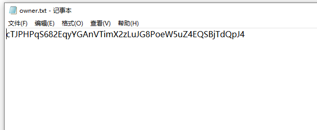
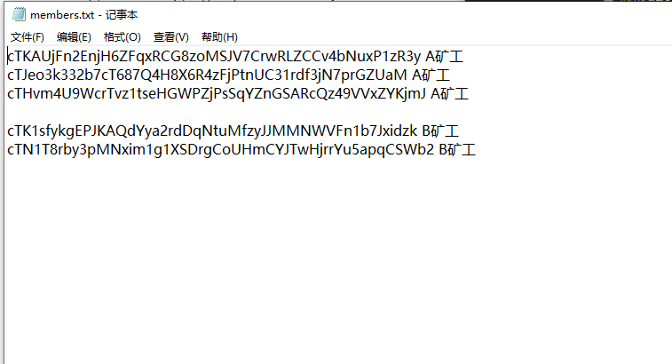
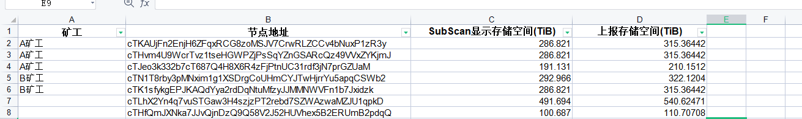
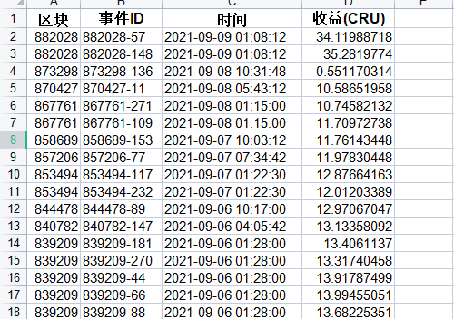

# Crust member 统计工具

### 一个小工具，用于Crust挖矿中，统计各个member所占的算力并生成excel，通常用于合作模式中的收益分配，省去人为统计的时间。

## 使用

1. 打开owner.txt 填写 group owner的地址。

2. 打开members.txt 填写 member地址 与矿工的对应关系。

3. 双击CrustMinerStatistics.exe生成excel，在导出文件夹中查看生成的excel。

4. 自行进行筛选，计算，存档。

